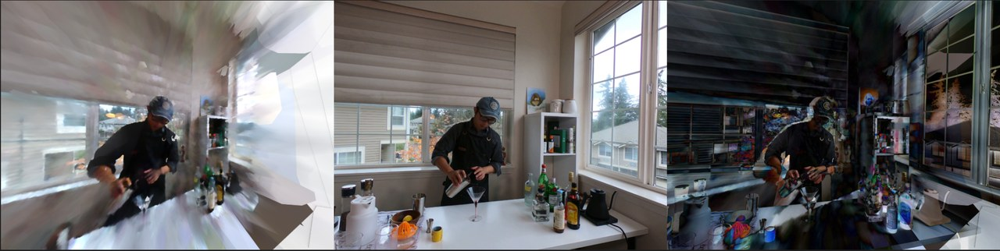
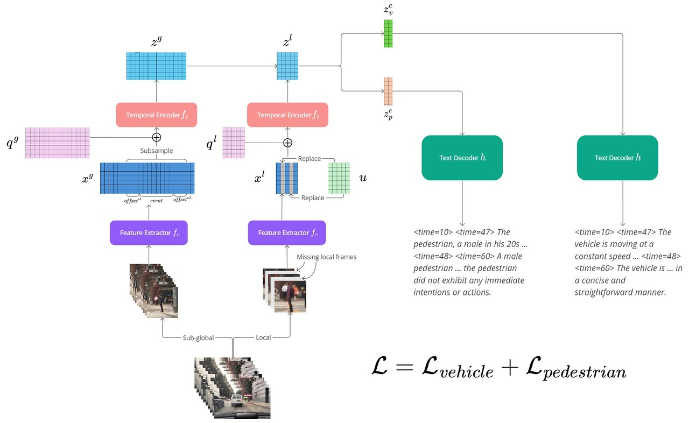
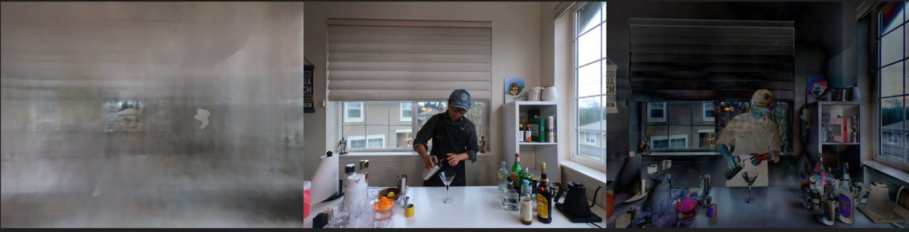
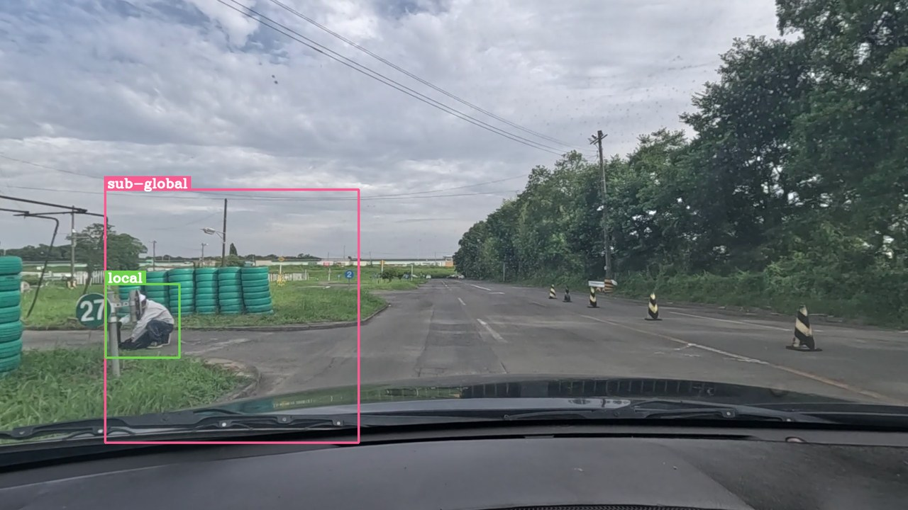

Most real-world environments move, yet most high-quality radiance-field methods assume the scene stands perfectly still. For my final project in **CMPT 469: Rendering and Visual Computing for AI** (taught by the GOAT, [Manolis Savva](https://msavva.github.io/)), I set out to add a temporal axis to [**Radiant Foam**](https://radfoam.github.io/) and reconstruct *dynamic* scenes from multi-view video. It was an ambitious swing, and an honest one: it did not fully work — but the failures were the interesting part.

<figure>
  
  <figcaption>Renderings of a moving scene reconstructed by the dynamic model at different time steps.</figcaption>
</figure>

## The starting point

Given multi-view video, the goal is to learn a 3D representation that captures how objects and scenes change over time — directly useful for animation, urban planning, and VR/game development. Existing dynamic-reconstruction work tends to either learn 6D plenoptic functions that ignore explicit motion, or model a deformation field that explicitly captures spatial motion. Both directions usually **trade rendering quality for speed, or vice versa**.

[Radiant Foam](https://radfoam.github.io/) is a real-time ray-tracing method that captures high-quality *static* scenes by partitioning 3D space into a dense **Voronoi tessellation** — every point belongs to exactly one Voronoi cell. As a ray travels, it accumulates the radiance of all cells it passes through to produce the final pixel colour. My project asked a simple question: *can we make this mesh move through time without giving up its speed?*

## Method

I made the per-point attributes functions of time rather than constants:

- **Temporal density** is modelled with an exponential temporal radial basis function, parameterised by a temporal scale, a temporal mean, and the spatial density in canonical space.
- **Motion** is modelled with a 4-degree polynomial in time.
- **Appearance** uses **4D spherical harmonics**, formed by merging the 3D SH coefficients with a 1D Fourier sequence.

<figure>
  
  <figcaption>Per-point temporal density, polynomial motion, and 4D spherical harmonics layered on top of Radiant Foam's Voronoi representation.</figcaption>
</figure>

### Two failure modes, two fixes

Training surfaced two recurring problems, each of which had a satisfying remedy:

1. **Structure collapse.** With discrete frame times, the scene structure would suddenly collapse and take a few hundred iterations just to recover. Injecting small Gaussian noise into the frame time during training (σ = average frame duration ÷ 4, clipped to stay near the true time) **largely eliminated the collapses**.
2. **Intensity tunnel vision.** The model fixated on high-intensity colour regions and ignored the rest of the scene. Adding an **SSIM** perceptual loss — which weighs luminance, contrast, and local structure — on top of Radiant Foam's losses dramatically widened its focus.

<figure>
  
  <figcaption>With the SSIM loss, this rendering quality was reached at iteration ~500; without it, comparable quality took 12,000–16,000 iterations.</figcaption>
</figure>

I also tried a learned alternative — a small fully-connected **deformation network** taking canonical position, density, and time *t* and predicting motion/density offsets — but even simple scenes blew up VRAM and ran out of memory.

## Results

<figure>
  
  <figcaption>Qualitative results on a subset of the Neural 3D Video dataset.</figcaption>
</figure>

- **Monocular, synthetic (D-NeRF):** the model failed to converge — likely too little data.
- **Monocular, real (Neural 3D Video subset):** locally sharp renderings, but it overfit the training views and couldn't render from correct novel angles — a single viewpoint simply doesn't cover enough angular range to generalise.
- **Multi-view (Neural 3D Video):** far more demanding in compute and time. I couldn't finish training, but intermediate renderings generalised to correct viewing angles, learned static regions cleanly, and *started* to capture motion.

Because most runs were incomplete, I had no clean baseline and ranked models by how closely their renderings matched ground-truth frames.

## Takeaways

- **Temporal radial basis modelling struggles on monocular video**, especially when viewing angles barely vary.
- **Mesh-based dynamic reconstruction is extremely sensitive to pruning.** Any pruning I tried degraded training; I had to settle for a simple densification strategy that just fills large, empty cells.
- **Point density is delicate** — I tried many functions before finding one that trained stably.
- **The "fast training" claims of many methods quietly assume the whole dataset fits in CPU RAM.** That assumption breaks for multi-view video, where the data volume is simply too large.

## Where it goes next

Speed is everything here, so the next steps are systems-shaped: a **dynamic AABB tree** for triangulation, a way to maintain the adjacency list without re-triangulating every step, a better pruning/densification strategy, and a richer motion model. The full write-up, milestone reports, and proposal live in the [project repository](https://github.com/quangminhdinh/CMPT469-Final).
