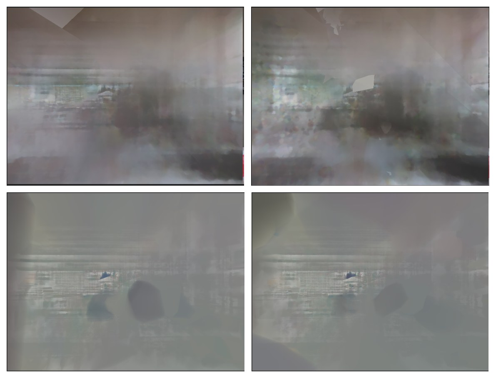
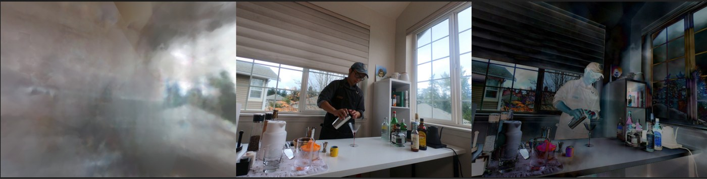
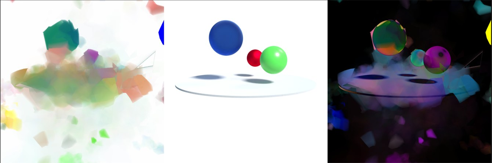
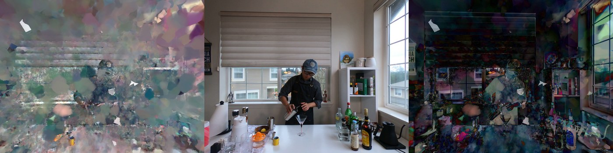

Most real-world environments move, yet most high-quality radiance-field methods assume the scene stands perfectly still. For my final project in [**CMPT 469: Rendering and Visual Computing for AI**](https://www.sfu.ca/outlines.html?2025/spring/cmpt/469/d100), I set out to add a temporal axis to [**Radiant Foam**](https://radfoam.github.io/) and reconstruct *dynamic* scenes from monocular and multi-view video. It was an ambitious swing, and an honest one: it did not fully converge, but the failure modes were the interesting part, and each one had a satisfying remedy.

<figure>
  
  <figcaption>Monocular reconstruction on a Neural 3D Video scene. <em>Left:</em> the model's rendering. <em>Middle:</em> the ground-truth frame. <em>Right:</em> the per-pixel L1 error map. Locally sharp, but the single viewpoint leaves the model unable to render correct novel angles.</figcaption>
</figure>

## From static to moving scenes

Given a monocular video or several synchronized multi-view videos, the goal of dynamic reconstruction is to learn a representation that captures how objects, people, lighting, and surfaces change over time, directly useful for animation, urban planning, and AR/VR. Existing work tends to split two ways: methods that learn a 6D plenoptic function and let a neural network absorb the motion implicitly, and methods that model motion explicitly through a deformation field or time-conditioned structure. Both directions usually **trade rendering quality for speed, or speed for quality**, and most can only hold a scene together for a few seconds.

[Radiant Foam](https://radfoam.github.io/) is a real-time *static* method that sidesteps the rasterization bottleneck of 3D Gaussian Splatting by ray-tracing through a dense **Voronoi tessellation**: 3D space is partitioned into cells, every point belongs to exactly one cell, and the density and radiance are held constant inside each cell. A ray accumulates the contributions of the cells it cuts through. Starting from the volume-rendering integral along a ray $\mathbf{r}$ between $q_{\min}$ and $q_{\max}$,

$$
\mathbf{c_r}=\int_{q_{\min}}^{q_{\max}} T(q)\,\sigma(\mathbf{r}(q))\,\mathbf{c}(\mathbf{r}(q))\,dq,
\qquad
T(q)=\exp\!\Big(-\!\int_{q_{\min}}^{q}\sigma(\mathbf{r}(u))\,du\Big),
$$

the constant-per-cell assumption collapses the integral into a sum over the $M$ segments the ray spends inside successive cells:

$$
\mathbf{c_r}=\sum_{m=1}^{M} T_m\big(1-e^{-\sigma_m\delta_m}\big)\,\mathbf{c}_m,
\qquad
T_m=\prod_{j=1}^{m} e^{-\sigma_j\delta_j},
$$

where $\sigma_m$ and $\mathbf{c}_m$ are the cell's density and radiance and $\delta_m$ is the width of segment $m$. That gives photorealistic renderings with complex lighting at real-time speed, which makes it a tempting base for dynamic reconstruction. My project asked a simple question: *can the foam move through time without giving up its speed?*

## Putting time into the foam

Radiant Foam stores three per-point quantities as learnable parameters: position, density, and the spherical-harmonic (SH) coefficients that produce view-dependent color. To make the scene dynamic, I turned each of these into a **function of time** $t$, borrowing the temporal radial-basis idea from Spacetime Gaussian but with modifications that trained more stably on the foam.

**Temporal density.** Each point's density is gated by a Gaussian bump in time, so a point only contributes around the moment it is actually visible:

$$
\sigma_i(t)=\sigma_i^{s}\,\exp\!\left(-\frac{\lvert t/T-\mu_i^{\tau}\rvert^{2}}{\exp(2 s_i^{\tau})}\right),
$$

where $T$ is the scene duration, $\sigma_i^{s}$ is the time-independent (canonical) density reused from Radiant Foam, $\mu_i^{\tau}$ is the **temporal center** (the timestamp at which point $i$ is most visible), and $s_i^{\tau}$ is a learnable temperature setting how long it stays visible.

**Temporal position.** Motion is a polynomial offset from the canonical position $\mu_i^{s}$, expanded around the point's own temporal center:

$$
\mu_i(t)=\mu_i^{s}+\sum_{k=1}^{n_p} b_{i,k}\,(t/T-\mu_i^{\tau})^{k}.
$$

I used degree $n_p=5$ rather than the degree 3 of Spacetime Gaussian; lower degrees trained noticeably worse on the foam.

**Temporal spherical harmonics.** To let color change over time, I modulated each spatial SH coefficient by a 1D Fourier term, which keeps the expensive CUDA SH evaluation untouched and only rescales the coefficients:

$$
sh_i(t)=\sum_{j=1}^{l}\cos\!\left(\frac{2\pi j}{T}\,t\right)a_i^{s,j}\,sh_i^{s,j},
$$

where $a_i^{s,j}$ and $sh_i^{s,j}$ are the $j$-th magnitude and basis coefficient of the static SH, and $j$ doubles as the order of the Fourier series.

## Two instabilities, and two fixes

Training surfaced two recurring problems. Both turned out to be informative, and each had a clean remedy.

### Structure collapse, fixed by temporal perturbation

With discrete frame times, structure the model had cleanly learned by a few hundred iterations would suddenly **collapse**: color jitter spread across the image and local geometry fell apart, and it took hundreds more iterations just to recover. The likely cause is that discrete timestamps give the model no signal about temporal *continuity*, so I made time continuous by jittering it. For each training frame I sampled a perturbed time from a Gaussian centered on the true time $t$, with standard deviation one quarter of the average frame duration $\Delta t$, clipped so it never strays more than half a frame:

$$
t'\sim\mathcal{N}\!\big(t,\,(\Delta t/4)^2\big),
\qquad
\lvert t'-t\rvert \le \Delta t/2.
$$

This small change **largely eliminated the collapses** and made the model markedly more robust for the rest of training.

<figure>
  
  <figcaption><strong>Top:</strong> without perturbation, coherent structure at iteration 1,500 (left) collapses by iteration 2,000 (right). <strong>Bottom:</strong> with temporal perturbation, structure learned at iteration 1,500 is preserved through iteration 2,000.</figcaption>
</figure>

### Color-gradient dependency, fixed by an SSIM loss

The second failure was subtler. The model leaned on color gradients to learn temporal correspondence, so it fixated on **high-intensity regions** and ignored the rest of the scene. The error map makes it obvious: bright areas get reconstructed while large swaths stay blank.

<figure>
  
  <figcaption>The color-gradient dependency problem. <em>Left:</em> rendering. <em>Middle:</em> ground truth. <em>Right:</em> L1 error map. The model pours its capacity into high-intensity regions and leaves the rest unreconstructed.</figcaption>
</figure>

The fix was to add a **Structural Similarity (SSIM)** loss on top of Radiant Foam's objective. SSIM is a perceptual loss that weighs luminance, contrast, and, crucially, *local structure*:

$$
\mathcal{L}_{\text{SSIM}}(x,y)=1-\frac{(2\mu_x\mu_y+c_1)(2\sigma_{xy}+c_2)}{(\mu_x^2+\mu_y^2+c_1)(\sigma_x^2+\sigma_y^2+c_2)},
$$

with $\mu$, $\sigma^2$, and $\sigma_{xy}$ the local pixel means, variances, and covariance. The final training objective just adds it to Radiant Foam's loss $\mathcal{L}_{\text{RF}}$:

$$
\mathcal{L}=\mathcal{L}_{\text{RF}}+\lambda\,\mathcal{L}_{\text{SSIM}},\qquad \lambda=0.25.
$$

The effect was dramatic. The model switched to reconstructing the whole scene uniformly, and it converged far faster: the rendering below was reached at **iteration ~500 with SSIM**, whereas comparable quality without it took **12,000–16,000 iterations**, a roughly 25× speedup.

<figure>
  
  <figcaption>With the SSIM loss. <em>Left:</em> rendering. <em>Middle:</em> ground truth. <em>Right:</em> L1 error map. Error is now spread evenly instead of concentrating on bright regions.</figcaption>
</figure>

I also tried a learned alternative: a small fully-connected **deformation network** that takes a canonical position, density, and time $t$ and predicts motion and density offsets. Even on simple scenes its VRAM use blew up and it ran out of memory, so it never became a serious contender.

## Results

I evaluated on both settings. For **multi-view**, I used the *coffee-martini* scene from [Neural 3D Video](https://github.com/facebookresearch/Neural_3D_Video) (six real scenes, roughly 10 seconds each), extracted at 30 FPS using only the first 30 frames, holding out camera 0 for testing, initializing points with COLMAP, and downsampling frames 4×. For **monocular**, I used the *bouncing balls* scene from the synthetic [D-NeRF](https://github.com/albertpumarola/D-NeRF) dataset, plus a monocular cut of Neural 3D Video (150 frames from camera 0 for training, 150 from camera 7 for testing).

Training used Adam with degree-3 spherical harmonics for 50,000 iterations: the first 2,000 are warm-up, and the cell count grows until iteration 31,000. Because each point's neighbours change with time, I could not rely on Radiant Foam's lazy triangulation. Its AABB tree was rebuilt incrementally every iteration and fully rebuilt every 1,000 iterations, where the original codebase only rebuilds after densification and near the end. That triangulation cost is exactly what made full multi-view training too expensive to finish. With no completed baseline to compare against, models were ranked by how closely their renderings matched the ground-truth frames.

**Monocular, synthetic (D-NeRF).** The model failed to converge and rendered incorrect colors. Some point positions land roughly right, but most drift far from ground truth, most likely because the data is simply too sparse.

<figure>
  
  <figcaption>D-NeRF <em>bouncing balls</em>, monocular. <em>Left:</em> rendering. <em>Middle:</em> ground truth. <em>Right:</em> L1 error map. The model never converges to the correct colors or geometry.</figcaption>
</figure>

**Monocular, real (Neural 3D Video cut).** Renderings are locally sharp (the teaser above), but the model overfits the training views and cannot produce correct novel angles. A single viewpoint just does not span enough angular range to generalize.

**Multi-view (Neural 3D Video).** Far more demanding in compute and time, so training never finished. But the intermediate renderings are encouraging: the model **generalizes to the correct viewing angle**, cleanly learns static regions, and *starts* to pick up motion.

<figure>
  
  <figcaption>Multi-view reconstruction on Neural 3D Video. <em>Left:</em> rendering. <em>Middle:</em> ground truth. <em>Right:</em> L1 error map. Even without completed training, the model renders from the correct novel viewpoint and recovers static structure.</figcaption>
</figure>

## Takeaways

- **Temporal radial-basis modelling struggles on monocular video**, especially when viewing angles barely vary; the multi-view setting is where it shows promise.
- **Mesh-based dynamic reconstruction is extremely sensitive to pruning.** Every pruning scheme I tried degraded training, so I fell back to a simple densification that just fills large empty cells. Future methods should confirm gains with densification alone before adding any pruning.
- **Point density is delicate.** It took many candidate temporal functions before one trained stably, and degree-5 motion polynomials clearly beat degree 3.
- **The "fast training" claims of many methods quietly assume the whole dataset fits in memory.** That assumption breaks for multi-view video, where the data volume and the repeated triangulation dominate the runtime.

## Where it goes next

Speed is everything here, so the open problems are systems-shaped: a **dynamic AABB tree** for triangulation, a way to maintain the adjacency list without re-triangulating every step, a better pruning and densification strategy tuned for this representation, and a richer motion model for the monocular case. The full write-up lives in the [report](report.pdf), the slides are [here](slides.pdf), and the implementation, with the proposal and milestone reports, is in the [project repository](https://github.com/quangminhdinh/CMPT469-Final).
