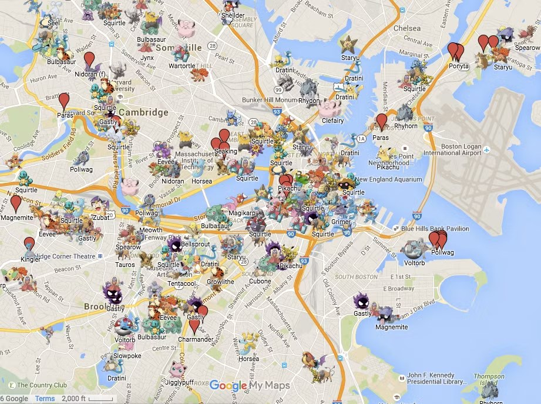
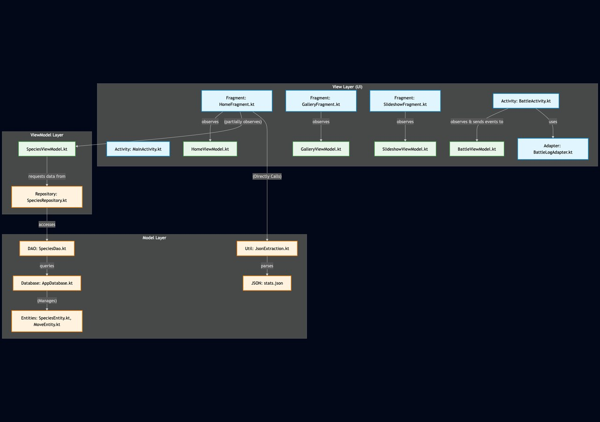

**GeoMon** is a lightweight, location-based RPG for Android: players explore real-world maps, encounter monsters spawned around their GPS location, battle and capture them, duel other players in real time, and chat with their active monster powered by an LLM. It was my team's project for [**CMPT 362: Mobile Application Development**](https://www.sfu.ca/outlines.html?2025/fall/cmpt/362/d100), and I built the location-tracking service, the real-time PvP duel system, and the Firebase backend (player and monster state) and authentication, plus the player's directional sprites and a share of the monster spawning.

## Demos

The full project presentation, which walks through the design end to end:

<iframe src="https://www.youtube.com/embed/0FHlLX5ixUo" title="GeoMon final presentation" allowfullscreen></iframe>

And the two show-and-tell demos:

  
<iframe src="https://www.youtube.com/embed/O8q0oeOwNfc" title="GeoMon Demo 1" allowfullscreen></iframe>

  
<iframe src="https://www.youtube.com/embed/kmky_mS402U" title="GeoMon Demo 2" allowfullscreen></iframe>

<figure>
  
  <figcaption>The live map: players roam the real world, encounter monsters that spawn around them, and see other online players nearby.</figcaption>
</figure>

## What it does

- **Location-based map.** A GPS-backed location service tracks the player and streams updates to the UI through a bound service and message handler.
- **Monster spawning.** If fewer than 10 monsters exist within a radius of the player, the system spawns new ones with random species. As you move, fresh monsters appear, and all wild monsters are **synchronised across players** through the Firebase real-time database.
- **Capture & battle.** Tap a monster to fight; the first full-HP monster in your Pokedex leads. Capture probability scales with the target's remaining HP, so you whittle it down before throwing.
- **Real-time PvP duels.** One player sends a `DuelRequest`; on accept, both devices launch the battle and share a single `BattleState` object in Firebase. Each move is applied locally first, then written to `BattleState`; the turn field flips and the opponent's listener replays the change. A heartbeat of timestamps marks players online so nearby duelists show up on the map.
- **AI companion chat.** Players talk to their active monster through the **Gemini API**, with all network calls isolated on the IO thread.

## Architecture

The app leans hard on Android's threading and persistence primitives. The UI thread owns the map, markers, and battle screens; a **Room** database caches parsed species/skill/item data so monsters can be instantiated anywhere without re-parsing JSON; and a `Monster` data class acts as the bridge between Firebase's remote representation and the local objects (mapping sprites from stored URIs along the way). Authentication uses Firebase **anonymous auth** per device, and a user object in the realtime DB holds each player's monster IDs: any monster *without* an owner ID is, by definition, a wild monster.

<figure>
  
  <figcaption>The MVVM + threading design: UI thread, IO/Room persistence, Firebase worker pools, and the location service.</figcaption>
</figure>

## Building it

The work split cleanly across five of us: Brandon built the turn-based battle engine, the JSON stats repository, and the inventory and stat screens; Long handled monster spawning, the map merge, sprites, the Gemini chatbot, and the profile settings; Yizhang built the main UI shell. My half was the systems layer underneath all of that, the location-tracking service, the Firebase data model, authentication, and the PvP duels, which also made me the person constantly merging everyone's branches and resolving the conflicts where our pieces met.

The single biggest structural decision was refactoring from a Room-only design to **Firebase + Room** once we committed to multiplayer. Local persistence alone could never let two phones agree on the world, so Room became a cache for static reference data while Firebase became the source of truth for anything live, players, monster state, and duels.

At our mid-project show-and-tell the UI wasn't ready yet, so I demoed everything on a deliberately bare map of plain markers and faked a second player by running the app on my own second phone. That second device turned out to be the most useful debugging tool of the project: real-time multiplayer bugs only surface when two clients disagree, and the only honest way to see that is to hold both in your hands. The location service started as a textbook bound-service-plus-message-handler setup, and by the final build I had pulled that data flow behind a `TrackingViewModel` so the rest of the app never needed to know where a location update came from.

The duels were the part I am proudest of and the part that fought back hardest: getting two phones to share one authoritative `BattleState`, apply moves optimistically, and reconcile through listeners without the turn order ever desyncing took far more care than the battle maths itself. The unglamorous lessons stuck just as well, branch per feature and merge deliberately, write down how a feature works the moment you push it, and never, ever commit an API key.

## Takeaways

- **Real-time multiplayer is mostly a state-synchronisation problem.** A single shared `BattleState` with listener-driven turns is far simpler to reason about than ad-hoc message passing.
- **"Optimistic local, then sync" keeps duels feeling instant** even with network latency: apply the move locally, write to Firebase, let listeners reconcile.
- **Caching reference data in Room** removes a surprising amount of friction: monsters can be spawned anywhere in the app without touching the JSON seed again.

