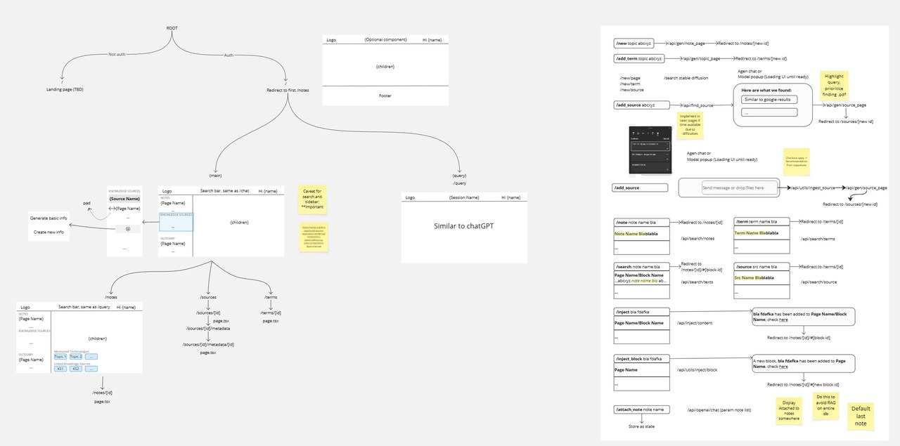
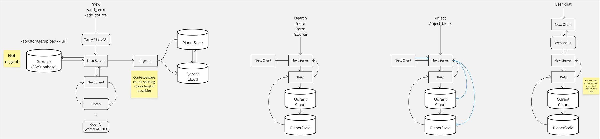
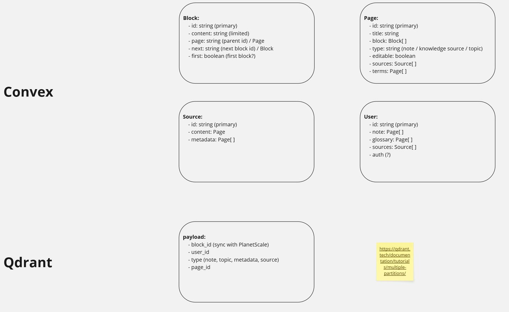
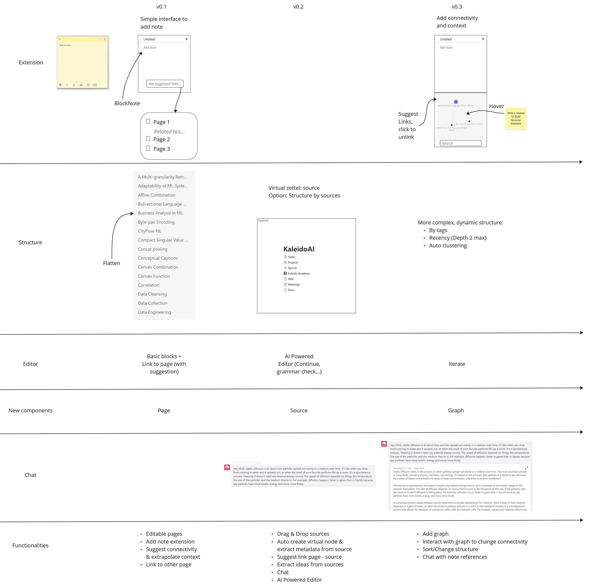

**MirrorBrain** was an LLM-augmented, **Zettelkasten-style** note-taking app: an Obsidian-like graph of atomic notes where the model auto-generates connections, context, and metadata between ideas. It was the flagship product of **KaleidoAI**, my startup attempt through the **[Ethos Fund](https://www.ethosfund.vc/) New Venture Challenge**. I led a team of five across architecture, database, REST API, and Kanban delivery.

It did not succeed, and the reason was **execution, not idea**. I'm keeping it here precisely because the post-mortem taught me more than a polished win would have.

<figure>
  
  <figcaption>The UX wireframe: a Notion-style command palette over an Obsidian-style linked-note graph.</figcaption>
</figure>

## The concept

The product centred on a few interlocking ideas:

- **Notes** with an Obsidian-style structure, editable like Notion, linkable to knowledge sources, and quick to scaffold from a short description.
- **Knowledge sources** ingested from PDFs, docs, slides, websites, YouTube, and podcasts, then auto-summarised into chapter summaries, Q&A, related works, and tags.
- **A glossary** that auto-builds definitions and related concepts from terms extracted out of your notes.
- **A chat interface** that retrieves across multiple notes and sources, with a fast Notion-like command bar.

## What I built and led

<figure>
  
  <figcaption>System architecture spanning the Next.js frontend, FastAPI services, and the data layer.</figcaption>
</figure>

The stack was **Next.js + TypeScript + Tailwind** with **[BlockNote](https://www.blocknote.dev/)** as the editor, a **FastAPI** backend, **Convex** for real-time data, and **Qdrant** for vector search. Two engineering details I'm still fond of:

- **Reverse-engineering BlockNote's side-menu UI** to bend the editor into the linked-note interactions the product needed.
- **Replacing Qdrant vector search with Okapi BM25** for the text-retrieval path: for our note-sized corpus, lexical BM25 was *faster and good enough*, and it removed an entire moving part from the hot path.

<figure>
  
  <figcaption>The database schema behind notes, sources, and their connections.</figcaption>
</figure>

<figure>
  
  <figcaption>A milestone prototype of the working app.</figcaption>
</figure>

## Post-mortem

- **The idea wasn't the problem; execution was.** We over-invested in product surface and architecture before pressure-testing demand and shipping cadence: the classic founder trap.
- **Sometimes the boring choice wins.** Swapping a vector DB for BM25 was a small reminder that the simplest tool that clears the bar beats the impressive one that doesn't.
- **Leading five people taught me delivery discipline** (Kanban, scoping, and saying no) more than any single technical task did.

Code for the v0 build lives in the [KaleidoAI repo](https://github.com/KaleidoAI/mirror-brain-v0).
