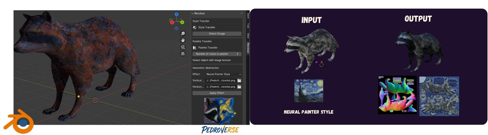
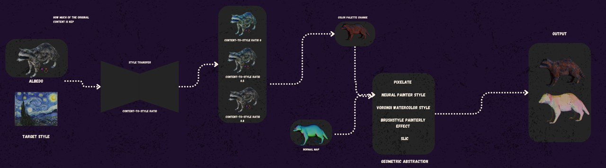
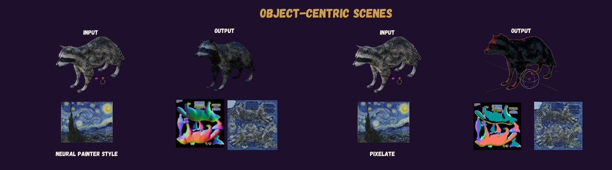

**PedroVerse** is a **Blender add-on** that turns hyper-realistic 3D assets into vibrant **non-photorealistic (NPR)** styles, *without* engine-specific shaders or external photo-editing tools. The trick: instead of touching geometry or writing shaders, we operate entirely on the asset's **UV maps** (albedo and object-space normal maps), which almost every asset already ships with and which render cheaply everywhere. It was a team project for **CMPT 461: Computational Photography**.

<figure>
  
  <figcaption>PedroVerse stylizes 3D assets by directly editing their albedo and object-space normal maps: a wide range of NPR looks, no engine-specific shaders.</figcaption>
</figure>

## The key insight

A shader built in Blender often can't be exported to a game engine for rapid prototyping, and post-processing effects don't generalise across engines or VR environments. But **UV maps are universal**. They carry strong visual priors, they're inexpensive to render, and, crucially, the **normal map preserves dynamic lighting** even after stylization. So we define every stylization operation in **UV space**, combining classical image processing with lightweight deep learning into a modular, permutable pipeline.

## The pipeline

<figure>
  
  <figcaption>From input textures through style transfer, palette recoloring, and geometric abstraction, applied to both albedo and normal maps.</figcaption>
</figure>

- **Style transfer**: a lightweight pretrained model encodes content and style images, then interpolates by a user-controlled content-to-style ratio (high-quality textures in ~2–3 s).
- **Palette recoloring**: palette-based photo recoloring with a modified **k-means in LAB space**; the artist edits the extracted palette through an HSV color picker.
- **Geometric abstraction**: four interchangeable structural filters: classical **stroke-based rendering** (Bézier brush strokes swept along image gradients), the neural **Paint Transformer**, **SLIC** superpixels, **Pyxelate** 8-bit pixelation, and an anime-style Voronoi watercolor effect.

The hard part is applying these to the **normal map**: a wrong color shift there changes the direction light bounces off the surface, producing artifacts. We found that **gradient-aware methods** (brush strokes) are far safer than noisy splatting (neural paint), that **low SLIC compactness** suppresses sudden curvature shifts, and that a **bitwise mask** between the stylized and original normal map keeps everything inside valid UV space.

## Implementation & results

The UI is built on the **Blender Python API**; style transfer runs in TensorFlow, classical filters in OpenCV / scikit-image, and the Paint Transformer in PyTorch, with each component invoked via subprocess to dodge Blender's module-import quirks, then packaged as a single add-on. Even the least-optimised method takes at most ~1 minute per asset.

<figure>
  
  <figcaption>Results across both object-centric assets and full 3D environments.</figcaption>
</figure>

## Takeaways

- **Working in UV space buys portability for free.** By never touching geometry or engine shaders, the same stylization travels across engines and VR: the whole reason the approach is worth it.
- **Normal maps are unforgiving.** Stylizing albedo is easy; stylizing the normal map without breaking lighting forced most of the interesting engineering (gradient-awareness, compactness tuning, UV masking).
- **Classical + lightweight learning is a sweet spot** for interactive tools: fast enough to keep an artist in the loop, flexible enough to permute many looks.

We're also prototyping **CLIP-based** style transfer (CLIPstyler with ViT-B/32) to replace the VGG-based approach for text-driven stylization. Code is on [GitHub](https://github.com/quangminhdinh/pedroverse).
