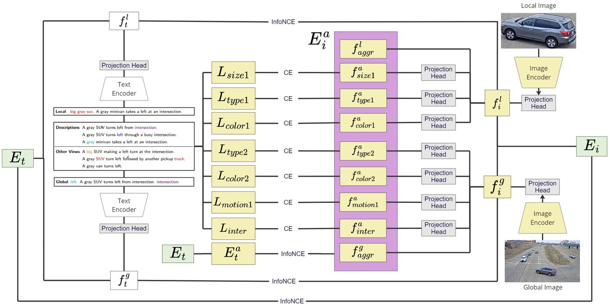
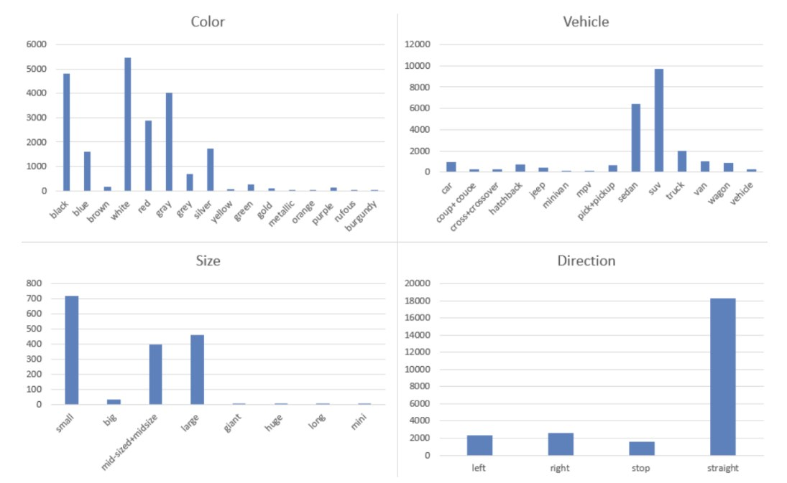
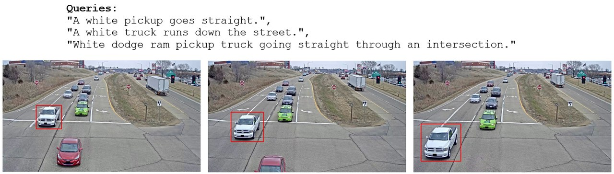

This was my **first large-scale research project carried out largely by myself**, and my first run at the **AI City Challenge**. The task, Track 2 of the 7th AI City Challenge (CVPR 2023), is *retrieving the right vehicle track from a natural-language description*: given a sentence like *"a gray SUV turns left at a busy intersection,"* find the matching video track among thousands. My solution, **SNDA (Symmetric Network with Dual-vehicle Attributes Augmentation)**, reached **35.44% MRR, 7th place** on the leaderboard.

<figure>
  
  <figcaption>SNDA: four branches learn local and global representations of both the text queries and the track images, fused and aligned with InfoNCE, then enhanced by a dual-vehicle attribute system.</figcaption>
</figure>

## Why the task is hard

Three problems make NL vehicle retrieval genuinely difficult:

1. **Ambiguous, information-poor queries**: a single sentence rarely pins down a vehicle.
2. **Tiny inter-class variation**: vehicles with different identities often share appearance and motion attributes.
3. **Data scarcity**: there simply isn't much annotated track/vehicle data to train a robust model.

## Approach

Building on the symmetric SSM architecture, SNDA uses **four branches** to capture *local* and *global* representations of each modality. Text features come from a frozen **RoBERTa**; visual features from an **EfficientNet-B2** backbone. The local and global features of each modality are concatenated and aligned with a **symmetric InfoNCE** loss across four visual–language pairs.

### Modelling motion without video models

Because every camera is static and backgrounds are stable, I generated a **motion map** per track by averaging all frames into a clean background and pasting the cropped vehicle from each frame's bounding box on top, skipping boxes whose IoU with the previous box exceeds 0.05 to avoid occlusion clutter. This turns a video into a single motion-bearing image the visual branch can consume cheaply.

### The dual-vehicle attribute system

The core idea: many queries describe **two nearby vehicles**, and that second vehicle is free supervision. I extract attributes (type, color, size, motion, and an "intersection" flag) by frequency-analysing the dataset's vocabulary, prioritising pairs of same-category words (`type1`/`type2`, `color1`/`color2`) that co-occur in a query.

<figure>
  
  <figcaption>Frequencies of words describing vehicle type, motion, size, and color: the basis for the attribute categories.</figcaption>
</figure>

These attributes drive two mechanisms:

- **Text augmentation**: prepending extracted attributes (e.g. `big gray suv.`) to queries to enrich sparse descriptions for the local and global text inputs.
- **Visual attribute heads**: seven projection heads predict attribute one-hot vectors from the visual features, trained with cross-entropy, so the visual side learns explicit attribute signals.

A post-processing step then adds **long-distance** (intersection detection) and **short-distance** (vehicle-to-vehicle relationship) similarity terms to the final matrix.

<figure>
  
  <figcaption>An example query–track pair from the CityFlow-NL dataset.</figcaption>
</figure>

## Results & the lesson that stuck

The ablations told a two-sided story. On the **validation set**, each technique helped, reaching 0.58 MRR / 0.87 R@5 / 0.94 R@10. But on the **test set**, natural-language augmentation actually *hurt*: the model had learned validation-specific quirks and **failed to cross the domain gap**. Only after feature engineering, ensembling, and post-processing did the test score recover to **0.35 MRR / 0.53 R@5 / 0.64 R@10**.

- **A strong validation number can be a trap.** The gap between 0.58 (val) and 0.35 (test) was almost entirely a domain-generalisation failure: my clearest early lesson that the test distribution is the only one that counts.
- **Cheap structure beats heavy machinery.** Motion maps and attribute heads gave most of the gains without any video transformer.
- **Free supervision is everywhere** if you read the data closely: the second vehicle in a sentence was hiding in plain sight.

The future direction I'd take from here is squarely **domain adaptation**, plus a better fusion mechanism for the augmentation signals. Code is on [GitHub](https://github.com/quangminhdinh/Dual-Vehicle-Aug-Symmetric-Net). This project also set the stage for [TrafficVLM](/publications/), my later AI City Challenge work that placed 3rd.
