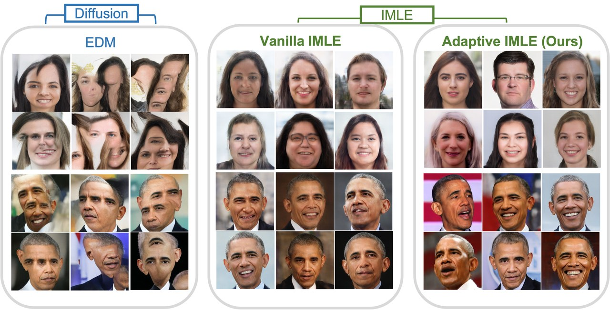
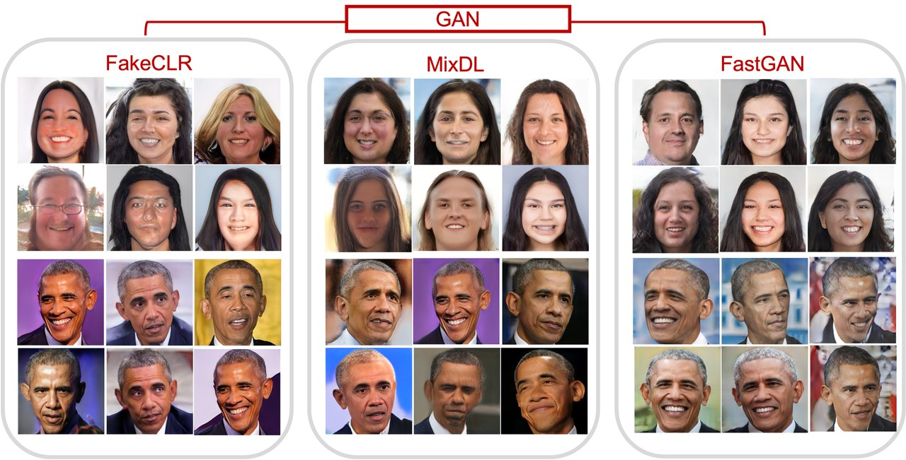

At [**APEX Lab**](https://sfuapex.ca/) (with [Ke Li](https://www.sfu.ca/~keli/)), I worked on extending **IMLE** — Implicit Maximum Likelihood Estimation — from unconditional image synthesis into the **text-conditional** setting, turning [Adaptive IMLE](https://github.com/quangminhdinh/AdaIMLE) into a small testbed for *how* a text prompt should steer a generator.

<figure>
  
  <figcaption>Generated samples from the IMLE pipeline.</figcaption>
</figure>

## Why IMLE

Unlike GANs — which maximise a likelihood through adversarial training and are prone to **mode collapse** in limited-data settings — IMLE optimises for **mode coverage**. Its objective makes sure *every real sample has a nearby generated counterpart*:

$$
\min_G\ \mathbb{E}_{x\sim p_{\text{data}}}\Big[\min_{z}\ \|x-G(z)\|^2\Big]
$$

In the conditional version, the generator becomes $G(z,c)$ and we model $p(x\mid c)$, where $c$ is a conditioning signal — here, a **text embedding**.

## What I built

The work spanned algorithm, infrastructure, and training, committed feature-by-feature (the [commit history](https://github.com/quangminhdinh/AdaIMLE/commits/main) reads like a changelog of the investigation):

- **Text-conditioned IMLE** core, then a sweep of conditioning architectures — **residual text injection**, a **conditional StyleGAN**-style generator, and embedding-concatenation conditioning — to see which actually lets the prompt control the output.
- **FAISS-based nearest-neighbour search**, replacing the original MDCI search. The IMLE matching step solves $j^* = \arg\min_j d(x_i, G(z_j))$, which is naively $O(NM)$ and dominates training cost; FAISS gives GPU-accelerated approximate search that scales with batch size, latent count, and embedding dimension.
- A **fused distance computation** using $\|a-b\|^2 = \|a\|^2 + \|b\|^2 - 2a^\top b$, so similarity reduces to a single matmul that GPUs and FAISS handle efficiently.
- A revised **latent resampling / assignment** scheme (how often to recompute matches, whether to cache them) trading compute against fresh assignments and training stability.
- Supporting pieces: a **text sampler**, **CLIP-based losses** (CLIP + L2-CLIP), **k-means** clustering, **text unit normalisation**, dataset normalisation statistics, and W&B image logging — benchmarked on **Oxford 102 Flowers** and **CelebA**.

<figure>
  
  <figcaption>A larger grid of results across the training run — IMLE's coverage-first objective in action.</figcaption>
</figure>

## What I found

The central difficulty is that nearest-neighbour matching is **non-differentiable**, so IMLE deliberately separates the *assignment* step from the *generator-optimisation* step. Conditioning quality then hinges on whether the conditioning embedding lives in a space the generator can actually use: across the architectures, failures traced back to **latent-space mismatches between the condition and the output**, rather than to the matching machinery itself. IMLE buys strong mode coverage — but only with enough latent samples, efficient search, and careful training configuration.

- **The bottleneck is the matching, not the model.** Most of the engineering payoff came from making nearest-neighbour search cheap (FAISS + fused distances), which is what makes conditional IMLE practical at all.
- **Conditioning is a representation problem.** A prompt only steers generation if its embedding is compatible with the generator's latent space — otherwise the condition is quietly ignored.
- **Coverage vs. quality is a real dial,** governed by latent-sample count and resampling cadence, not a free lunch.

Live metrics are public on [Weights & Biases](https://wandb.ai/quangminhdinh/AdaptiveIMLE?nw=nwuserquangminhdinh), and the implementation is on [GitHub](https://github.com/quangminhdinh/AdaIMLE).
