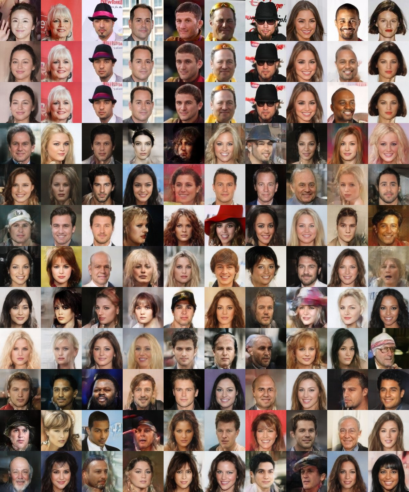
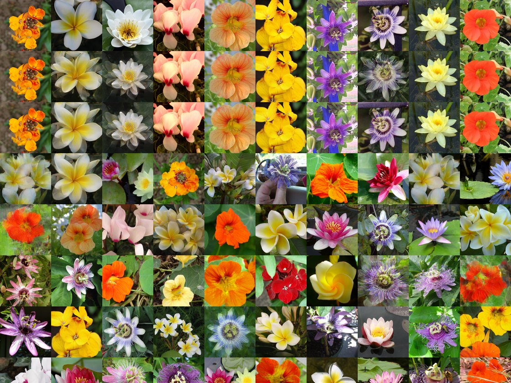
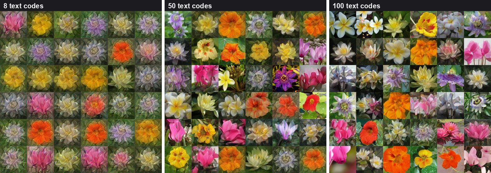
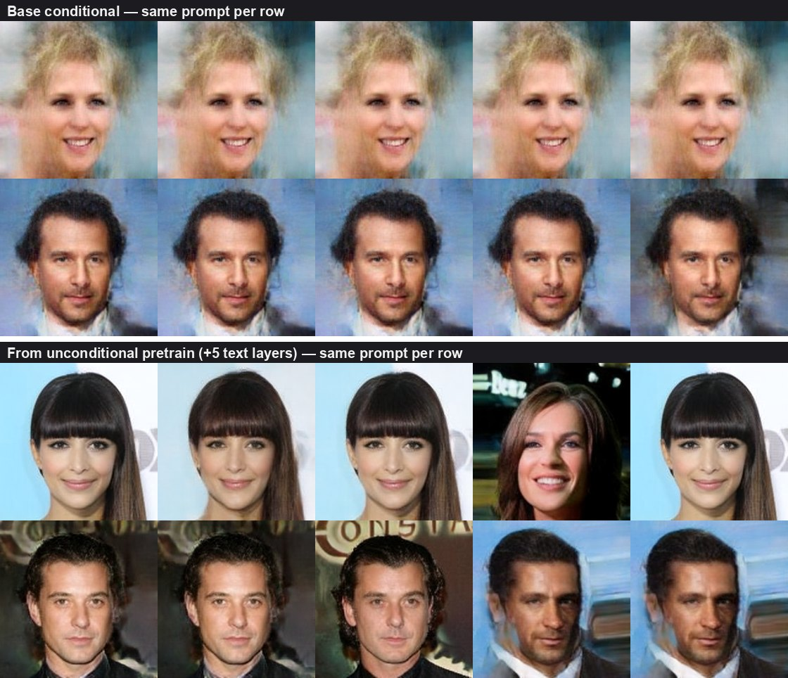

At [**APEX Lab**](https://sfuapex.ca/) (with [Ke Li](https://www.sfu.ca/~keli/)), I worked on extending **IMLE** (Implicit Maximum Likelihood Estimation) from unconditional image synthesis into the **text-conditional** setting, turning [Adaptive IMLE](https://github.com/quangminhdinh/AdaIMLE) into a testbed for one question: *how* should a text prompt steer a generator, and why does conditioning so often quietly kill sample diversity? Across more than a hundred runs on Oxford 102 Flowers, CelebA, and ImageNet, the answer kept pointing back at the same tension.

<figure>
  
  <figcaption>Samples from the conditional IMLE pipeline on CelebA. IMLE's coverage-first objective keeps the gallery varied (pose, age, lighting, accessories) instead of collapsing onto a few prototypes.</figcaption>
</figure>

## Why IMLE, and why in the small-data regime

GANs maximise a likelihood through an adversarial game, which makes them prone to **mode collapse**, especially when data is scarce. Diffusion models need a lot of data and sampling steps to behave. IMLE flips the objective around: instead of pushing generated samples toward the data, it pulls *every real sample* toward a nearby generated one, which directly optimises for **mode coverage**:

$$
\min_G\ \mathbb{E}_{x\sim p_{\text{data}}}\Big[\min_{z}\ \|x-G(z)\|^2\Big]
$$

That difference matters most when training data is limited, which is exactly where the Adaptive IMLE line of work this project builds on shows its edge: GANs and diffusion degrade into artefacts and broken faces, while Adaptive IMLE stays sharp *and* diverse.

<figure>
  
  <figcaption>The limited-data regime, GAN baselines: FakeCLR, MixDL, and FastGAN show repeated structure and artefacts. (Adaptive IMLE foundation, APEX Lab.)</figcaption>
</figure>

<figure>
  
  <figcaption>Same regime, diffusion vs IMLE: EDM produces malformed faces with few samples, vanilla IMLE is faithful but soft, and Adaptive IMLE recovers sharpness without sacrificing coverage. This unconditional method is the foundation I extended.</figcaption>
</figure>

In the conditional version, the generator becomes $G(z,c)$ and we model $p(x\mid c)$, where the condition $c$ is a **text embedding** (a CLIP encoding of a caption). The objective keeps its shape but now matches within each condition:

$$
\min_G\ \mathbb{E}_{(x,c)}\Big[\min_{z}\ \|x-G(z,c)\|^2\Big]
$$

## Making the matching cheap

Every IMLE step solves, for each real sample $x_i$, a nearest-neighbour search over the generated pool:

$$
j^* = \arg\min_j\ d\big(x_i,\, G(z_j)\big)
$$

This is naively $O(NM)$ in the number of real samples $N$ and latent draws $M$, and it dominates training cost. Before any conditioning experiments were possible, the matching had to be fast, so the first block of work was infrastructure:

- **FAISS nearest-neighbour search** replacing the original MDCI routine, giving GPU-accelerated approximate search that scales with batch size, latent count, and embedding dimension.
- A **fused distance computation** that expands the squared Euclidean distance into a single matrix multiply, the form GPUs and FAISS handle most efficiently:

$$
\|a-b\|^2 = \|a\|^2 + \|b\|^2 - 2\,a^\top b
$$

- A revised **latent resampling / assignment** schedule (the `force_resample` cadence): how often to recompute matches versus reuse cached ones, trading raw compute against fresh assignments and training stability. Resampling every 2 epochs turned out to be a good default, slightly improving FID and precision at a small recall cost.

The matching is also **non-differentiable**, so IMLE deliberately separates the *assignment* step from the *generator-optimisation* step. The whole investigation rides on this separation working.

## How should a prompt steer the generator?

With matching cheap, the core question became architectural: where and how do you inject the text embedding so the prompt actually controls the output? I built each variant as its own commit (the [history](https://github.com/quangminhdinh/AdaIMLE/commits/main) reads like a changelog) and benchmarked them on **Oxford 102 Flowers** at a reduced latent count $k{=}9$ for speed. Metrics are FID (lower is better) and the [improved precision / recall](https://arxiv.org/abs/1904.06991) pair, where **precision tracks fidelity** and **recall tracks diversity**, all read at a matched training budget.

| Conditioning architecture | FID ↓ | Precision ↑ | Recall ↑ |
|:---|---:|---:|---:|
| Residual injection (add text to latent) | 24.62 | 0.954 | 0.552 |
| Concatenation + linear downsample | 24.75 | 0.929 | 0.603 |
| **FiLM** (text-modulated affine) | 22.95 | 0.933 | 0.611 |
| **FiLM + light CLIP + L2** (best) | **21.58** | 0.942 | 0.599 |
| Conditional StyleGAN (noise injection) | 275.5 | 0.293 | 0.000 |
| Unconditional reference | 40.40 | 0.919 | 0.609 |

Conditioning architectures on Oxford 102 Flowers (k = 9), at a matched training budget. FiLM leads; conditional-StyleGAN noise injection collapses entirely.

Two results stood out. **FiLM**, where the text embedding modulates per-channel affine transforms, matched or beat every other injection scheme: the prompt gets to *gate* features rather than fight the latent for the same channels. At the opposite end, the **conditional-StyleGAN** style of injecting noisy text into the mapping network collapsed completely (FID near 275, recall zero), either fundamentally mismatched here or needing far more training than the budget allowed.

<figure>
  
  <figcaption>FiLM-conditioned samples on Oxford 102 Flowers (logged to W&B). Sharp, varied blooms: the strongest of the injection schemes I tried.</figcaption>
</figure>

The unconditional reference is the quiet lesson in this table: its FID is much worse, yet its recall is healthy. Conditioning *bought fidelity but spent diversity*, and chasing that lost diversity back became the rest of the project.

## Shaping the conditioning signal

Beyond architecture, I swept the *signal* itself: the auxiliary losses and the representation of the text embedding.

**CLIP loss has to be gentle, and never alone.** Adding a CLIP alignment loss between the prompt and the generated image helps only at a small weight, and only when paired with an L2 term; turn it up and quality craters.

| CLIP loss weight | FID ↓ | Precision ↑ | Recall ↑ |
|:---|---:|---:|---:|
| 0.1 | 22.73 | 0.930 | 0.555 |
| 0.5 | 31.05 | 0.936 | 0.485 |
| 1.0 | 48.26 | 0.944 | 0.454 |

Effect of the CLIP alignment-loss weight (Flowers, concatenation with per-block injection). Only a light CLIP term helps, and only alongside an L2 loss.

**The text representation sets a floor on quality.** Quantising captions into k-means codes makes the granularity tradeoff explicit. With only 8 codes the generator has too little to latch onto and never converges; push to 50 and then 100 codes and both fidelity *and* coverage recover, though pushing quantisation very fine eventually risks dropping the rarest flower types. Unit-normalising the CLIP embeddings, and randomly projecting them to low dimensions (64, 32, 5), both reliably hurt diversity too.

| Text k-means codes | FID ↓ | Recall ↑ | Behaviour |
|:---|---:|---:|:---|
| 8 codes | 196.2 | 0.009 | too coarse, fails to converge |
| 50 codes | 78.2 | 0.102 | recovering, slow |
| 100 codes | 45.6 | 0.203 | sharp and more diverse |

Quantising captions into k-means codes (Flowers, FiLM). Too few codes fail to converge; richer codebooks restore both fidelity and coverage.

<figure>
  
  <figcaption>Quantising captions into k-means codes (W&B grids). Eight codes collapse into a muddy, low-quality set; fifty and a hundred codes restore sharpness and variety. Coarse conditioning, not the matching, is the bottleneck here.</figcaption>
</figure>

Supporting machinery underneath all of this: a **text sampler**, **CLIP and L2-CLIP losses**, **k-means** clustering of captions, **text unit normalisation**, and dataset normalisation statistics, with W&B image and metric logging throughout, and early exploration on **ImageNet (32×32)** alongside the main Flowers and CelebA runs.

## The diversity problem, and what actually moved it

The same pattern followed me from Flowers to **CelebA**: conditional models produced clean faces but a narrowing range of them. The clearest way to see it is to fix a prompt and draw several latents. A plain conditional model returns near-duplicates; the prompt has effectively *pinned* the output. The single most effective fix was not a loss or an injection trick, it was **initialisation**, starting the conditional generator from a strong *unconditional* IMLE prior and letting the text branch adapt on top of it.

<figure>
  
  <figcaption>Same prompt per row, several latents each (W&B grids). <strong>Top:</strong> the base conditional model returns near-identical faces, the diversity collapse in one picture. <strong>Bottom:</strong> initialising from an unconditional IMLE prior and adapting a small text branch restores real within-prompt variation.</figcaption>
</figure>

**Classifier-free guidance** helped too, but proved brittle to its conditioning-dropout probability $p$.

| CelebA setup | FID ↓ | Precision ↑ | Recall ↑ |
|:---|---:|---:|---:|
| Base conditional | 12.94 | 0.995 | 0.668 |
| From unconditional pretrain | 18.37 | 0.939 | **0.784** |
| Pretrain + 5 text layers | 18.63 | 0.976 | **0.825** |
| Classifier-free guidance, $p{=}0.3$ | 17.59 | 0.979 | 0.695 |
| Classifier-free guidance, $p{=}0.1$ | 77.72 | 0.047 | 0.035 |

Restoring diversity on CelebA. Initialising from an unconditional prior lifts recall the most; classifier-free guidance helps but is brittle to the dropout rate p.

Note the tension in the first rows: the base model has the *best* FID and precision but the worst within-prompt variety. Initialising from the unconditional prior trades a few FID points to lift recall from the mid-0.6s into the low-0.8s, the clearest single intervention in the whole study. CFG at $p{=}0.3$ lands in a similar place, but dropping $p$ to $0.1$ collapses the model entirely (precision 0.05): the conditioning-dropout rate is a cliff, not a slider. Smaller architectures, frozen backbones, and random horizontal flipping all underperformed.

## What I took away

- **The bottleneck is the matching, then it isn't.** Making nearest-neighbour search cheap (FAISS plus fused distances) is what makes conditional IMLE feasible at all, but once it's fast, the matching machinery is no longer where the difficulty lives.
- **Conditioning is a representation problem, and a diversity tax.** A prompt only steers generation if its embedding is compatible with the generator's latent space (FiLM works, noisy StyleGAN injection doesn't), and even when it works, conditioning trades coverage for fidelity unless you fight to keep it.
- **The strongest lever was a good prior.** Initialising from an unconditional IMLE model, not a fancier loss, did the most to restore diversity, with light CLIP+L2 guidance and a well-tuned CFG dropout as supporting acts.
- **Several intuitive ideas reliably backfired:** heavy CLIP loss, unit-normalised embeddings, low-dimensional projections, coarse text quantisation, and conditional-StyleGAN noise injection each cost quality, diversity, or both.

Every run, metric curve, and qualitative grid is public on [Weights & Biases](https://wandb.ai/quangminhdinh/AdaptiveIMLE?nw=nwuserquangminhdinh) (organised into per-experiment [reports](https://wandb.ai/quangminhdinh/AdaptiveIMLE/reportlist)), and the implementation, committed feature by feature, is on [GitHub](https://github.com/quangminhdinh/AdaIMLE).
