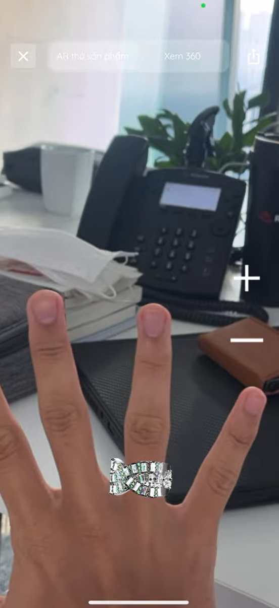

At **[YITEC](https://yitec.net/)**, as a Machine Learning Engineer (Oct 2020 – Jun 2021), I helped build **Vietnam's first real-time hand-tracking and AR ring try-on mobile app**, letting customers try on jewellery rings from their phones instead of visiting a store. This was my first ML-engineering role, *before I had any clue about AI research*; it was pure, hands-on exploration, and it became one of the most formative projects of my early career.

The project was a **major success, matching or beating the solutions of FPT and Viettel** at the time, and laid the foundation for one of YITEC's later core businesses.

<figure>
  
  <figcaption>The virtual ring rendered onto a tracked hand in real time.</figcaption>
</figure>

## Demo

<iframe src="https://www.youtube.com/embed/fMoTa7qCFho" title="Virtual Ring Try-On demo" allowfullscreen></iframe>

## The engineering problem

Putting a convincing virtual ring on a moving finger in real time is a stack of hard sub-problems (tracking, rendering, lighting, and latency), all at once, on a phone. My work spanned:

- **Hand tracking with MediaPipe Graph** on Android Studio, including research into frame conversion and exporting to **AAR** format for integration with **Unity**.
- **Real-time camera processing** in Unity via **AR Foundation**, and using **Google ARCore** to read the scene's lighting cues so the virtual ring and its reflection probe render under the *same* conditions as the real hand.
- **Placement maths**: deriving formulas for the ring's position, scale, and rotation from MediaPipe's relative landmark positions, plus an acceptable range for those factors that accounts for latency and vibration.
- **Porting the MediaPipe API to C#**, one call at a time, and attempting to integrate it with **Unity Barracuda** to eliminate frame conversion and cut latency.
- **Stabilisation & denoising**: experimenting with video-stabilisation and vibration-denoising algorithms that took the experience from **5 FPS to 30 FPS**.

## Takeaways

- **Real-time AR is a latency budget first, an ML problem second.** The biggest single win (5 → 30 FPS) came from stabilisation and removing frame conversions, not from a better model.
- **Physical realism sells the illusion.** Matching the ring's lighting and reflections to ARCore's scene cues mattered more to perceived quality than landmark precision.
- **This was my on-ramp to ML.** Approaching the field as an *engineer* first, shipping something real under hard constraints, shaped how I think about research today.

> The most recent version of this work is under NDA, so the public [repository](https://github.com/quangminhdinh/Virtual-Ring-TryOn) reflects the earlier exploration. See also the [YITEC project page](https://yitec.net/project/ar-ring-try-on/) and [JLM](https://jlm.yitec.net/).
